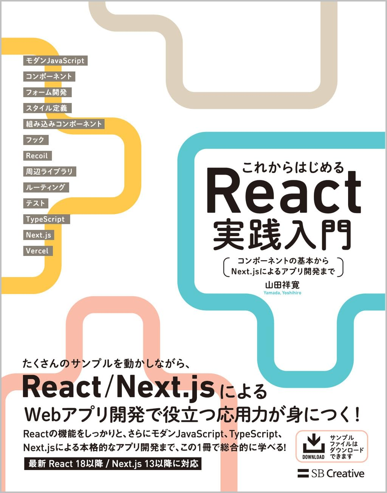

import { Aside, Code } from '@astrojs/starlight/components';
import importedCode from './sample.ts?raw';
import importHtml from './step.html?raw';

<Aside>補足情報のコンテンツ。</Aside>

<Aside type="caution">注意が必要なコンテンツ。</Aside>

<Aside type="tip">

補足情報には他のコンテンツも対応しています。

```js
// たとえば、コードスニペットなど。
```

</Aside>

<Aside type="danger">パスワードを誰にも教えないでください。</Aside>

<Code code={importedCode} lang="typescript" title="sample.ts" />
<Code code={importHtml} lang="html" title="step.html" />

